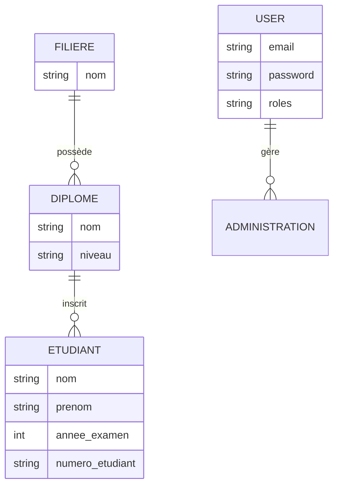

---

# 🎓 Plateforme de Gestion des Résultats d'Examens - Phase 1

## 📌 Présentation du projet

Ce projet consiste en une plateforme de gestion et de publication des résultats d'examens pour une école supérieure. Cette **Phase 1** se concentre sur l'établissement d'une fondation technique solide (le "Noyau Fonctionnel"), incluant la modélisation des données et la sécurisation de l'interface d'administration.

## 🛠 Stack Technique (Choix technologiques)

Conformément aux encouragements technologiques du sujet, les outils suivants ont été utilisés :

* **Back-End :** **Symfony 7.0** (PHP 8.0.3). Utilisation d'un framework professionnel pour structurer l'API et la logique métier.
* **Base de données :** **SQLite**. Base relationnelle obligatoire pour garantir l'intégrité des données via Doctrine ORM.
* **Sécurité :** Symfony Security Bundle avec hachage **BCrypt** et protection **CSRF** activée.
* **Front-End :** **Twig** pour le rendu serveur, configuré pour intégrer **Vue.js** en Phase 2.

## 📊 Modélisation des données (Livrable 1.a)

Le modèle Entité-Relation respecte la hiérarchie structurelle demandée :

* **Filière** : Entité parente regroupant les domaines d'études.
* **Diplôme** : Lié à une filière spécifique.
* **Étudiant** : Lié à un diplôme et à une année d'examen.
* **User** : Gère l'accès sécurisé à l'administration.



## 🚀 Installation et Configuration

1. **Installation des dépendances :**
```bash
composer install

```


2. **Initialisation de la base de données (Schéma) :**
```bash
php bin/console doctrine:migrations:migrate --no-interaction

```


3. **Création de l'administrateur (Preuve de stockage BdD) :**
```bash
php -r "require 'vendor/autoload.php'; (new Symfony\Component\Dotenv\Dotenv())->bootEnv('.env'); \$kernel = new App\Kernel('dev', true); \$kernel->boot(); \$em = \$kernel->getContainer()->get('doctrine.orm.entity_manager'); \$u = new App\Entity\User(); \$u->setEmail('admin@test.com'); \$u->setRoles(['ROLE_ADMIN']); \$u->setPassword(password_hash('admin123', PASSWORD_BCRYPT)); \$em->persist(\$u); \$em->flush(); echo 'ADMIN CRÉÉ : admin@test.com / admin123';"

```


## 🌐 Lancement et Test

1. **Lancer le serveur local :**
```bash
symfony serve

```


*(Ou `php -S 127.0.0.1:8000 -t public`)*

2. **Accès à l'interface :**
Rendez-vous sur [http://127.0.0.1:8000/login](http://127.0.0.1:8000/login).

3. **Identifiants de test :**
* **Email :** `admin@test.com`
* **Mot de passe :** `admin123`


## ✅ État des Livrables - Phase 1

* **Modélisation :** Schéma ER finalisé et base SQLite en place.
* **Back-End :** Environnement Symfony configuré et API CRUD amorcée.
* **Sécurité :** Système d'authentification fonctionnel avec gestion des sessions.
* **Documentation :** Ce fichier README fait office de guide technique et de plan d'architecture.

---
